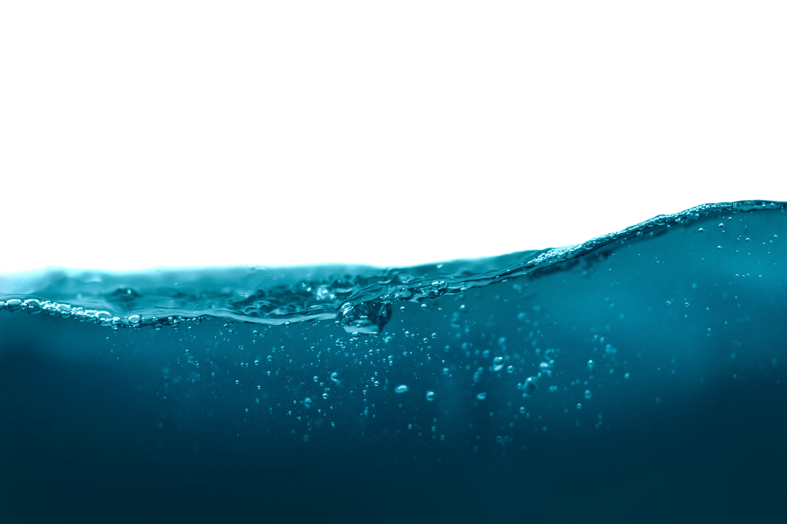

# Water Quality Visualization

Water is doubtlessly an essential natural resource for human survival. On that account, [Dietitians of Canada](https://www.dietitians.ca) recommends Canadians to consume on average 2.2 litres of water daily. Based on a recent report by [Statistics Canada](https://www150.statcan.gc.ca/t1/tbl1/en/tv.action?pid=3810004001), total water intake from all aquatic sources in 2017 was 3,767 million cubic metres. Hence, it is clear that any changes to water quality will significantly impact human health as well as economic and environmental conditions in Canada.

Now that we know how crucial water is in our daily lives, we may wish to look deeper into the water quality in Canada. The water quality in Canada earns an "A" grade and ranks in 4th place compared to the 17 peer OECD countries. But how can we be sure of that?

Statistics Canada has consistantly been monitoring various parameters that could influence Canada's aquatic ecosystems. How can we utilize this observational data to investigate the water quality in Canada?

## Goal:
The goal of this project is to look at different chemical or physical parameters that reveal to us the quality of water reserves across Canada. I will investigate the spread of harmful parameters in water reserves across all Canadian provinces. Do Canadian water reserves demonstrate a consistant decrease in harmful parameters? If they don't, what interesting trends can be seen in our visualizations?

## Programming Language: 
- Python 3
